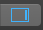
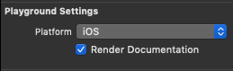

# Hackerrank-Problems
My solutions to various hacker rank problems in 

The code is written in markdown formatted xcode playground files for easy browsing.

## Usage Instructions
1. [Install xcode](https://apps.apple.com/ca/app/xcode/id497799835?mt=12) from the mac app store
2. Open HackerRankProblems.playground with xcode
3. click  in the top right and ensure that render documentation is checked.

